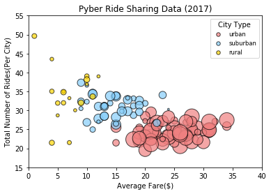
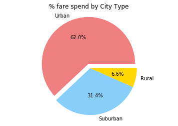
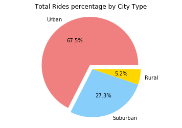
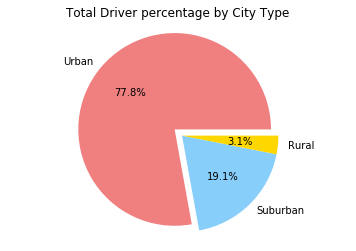

```python
#importing modules
import pandas as pd
import matplotlib.pyplot as plt
import numpy as np
```


```python
#reading csv
city_data = "raw_data/city_data.csv"
ride_data = "raw_data/ride_data.csv"

pd_city_data = pd.read_csv(city_data)
pd_ride_data = pd.read_csv(ride_data)
# pd_city_data.head()
# pd_ride_data.head()
```


```python
#sorting dataframe
pd_city_data = pd_city_data.sort_values(['city'])
pd_ride_data = pd_ride_data.sort_values(['city'])
```


```python
#creating new dataframe
avg_fare_city = pd.DataFrame(pd_ride_data.groupby("city")["fare"].mean()).reset_index()
total_ride_city = pd.DataFrame(pd_ride_data.groupby("city")["ride_id"].count()).reset_index()
total_driver = pd.DataFrame(pd_city_data.groupby("city")["driver_count"].sum()).reset_index()
total_type = pd.DataFrame(pd_city_data.groupby("city")["type"].sum()).reset_index()

#merging all the new dataframe
avg_merge_data = pd.merge(avg_fare_city, total_ride_city, how='left', on = 'city')
avg_merge_data = pd.merge(avg_merge_data, total_driver, how='left',on = 'city')
avg_merge_data = pd.merge(avg_merge_data, total_type, how='left', on = 'city')


avg_merge_data.head()
```


<div>
<style>
    .dataframe thead tr:only-child th {
        text-align: right;
    }

    .dataframe thead th {
        text-align: left;
    }

    .dataframe tbody tr th {
        vertical-align: top;
    }
</style>
<table border="1" class="dataframe">
  <thead>
    <tr style="text-align: right;">
      <th></th>
      <th>city</th>
      <th>fare</th>
      <th>ride_id</th>
      <th>driver_count</th>
      <th>type</th>
    </tr>
  </thead>
  <tbody>
    <tr>
      <th>0</th>
      <td>Alvarezhaven</td>
      <td>23.928710</td>
      <td>31</td>
      <td>21</td>
      <td>Urban</td>
    </tr>
    <tr>
      <th>1</th>
      <td>Alyssaberg</td>
      <td>20.609615</td>
      <td>26</td>
      <td>67</td>
      <td>Urban</td>
    </tr>
    <tr>
      <th>2</th>
      <td>Anitamouth</td>
      <td>37.315556</td>
      <td>9</td>
      <td>16</td>
      <td>Suburban</td>
    </tr>
    <tr>
      <th>3</th>
      <td>Antoniomouth</td>
      <td>23.625000</td>
      <td>22</td>
      <td>21</td>
      <td>Urban</td>
    </tr>
    <tr>
      <th>4</th>
      <td>Aprilchester</td>
      <td>21.981579</td>
      <td>19</td>
      <td>49</td>
      <td>Urban</td>
    </tr>
  </tbody>
</table>
</div>


```python
#Renaming columns for readability
pd_df = avg_merge_data.rename(columns={
    "city": "city",
    "fare" : "avg_fare",
    "ride_id" : "ride",
    "driver_count" : "driver",
    "type":"type"
})

pd_df.head()
```


<div>
<style>
    .dataframe thead tr:only-child th {
        text-align: right;
    }

    .dataframe thead th {
        text-align: left;
    }

    .dataframe tbody tr th {
        vertical-align: top;
    }
</style>
<table border="1" class="dataframe">
  <thead>
    <tr style="text-align: right;">
      <th></th>
      <th>city</th>
      <th>avg_fare</th>
      <th>ride</th>
      <th>driver</th>
      <th>type</th>
    </tr>
  </thead>
  <tbody>
    <tr>
      <th>0</th>
      <td>Alvarezhaven</td>
      <td>23.928710</td>
      <td>31</td>
      <td>21</td>
      <td>Urban</td>
    </tr>
    <tr>
      <th>1</th>
      <td>Alyssaberg</td>
      <td>20.609615</td>
      <td>26</td>
      <td>67</td>
      <td>Urban</td>
    </tr>
    <tr>
      <th>2</th>
      <td>Anitamouth</td>
      <td>37.315556</td>
      <td>9</td>
      <td>16</td>
      <td>Suburban</td>
    </tr>
    <tr>
      <th>3</th>
      <td>Antoniomouth</td>
      <td>23.625000</td>
      <td>22</td>
      <td>21</td>
      <td>Urban</td>
    </tr>
    <tr>
      <th>4</th>
      <td>Aprilchester</td>
      <td>21.981579</td>
      <td>19</td>
      <td>49</td>
      <td>Urban</td>
    </tr>
  </tbody>
</table>
</div>


```python
#Urban: fare, ride and driver only
pd_df_fare1 = pd_df.loc[pd_df["type"] == "Urban", "avg_fare"]
pd_df_ride1 = pd_df.loc[pd_df["type"] == "Urban", "ride"]
pd_df_drive1 = pd_df.loc[pd_df["type"] == "Urban", "driver"]

#SubUrban: fare, ride and driver only
pd_df_fare2 = pd_df.loc[pd_df["type"] == "Suburban", "avg_fare"]
pd_df_ride2 = pd_df.loc[pd_df["type"] == "Suburban", "ride"]
pd_df_drive2 = pd_df.loc[pd_df["type"] == "Suburban", "driver"]

#Rural: fare, ride and driver only
pd_df_fare3 = pd_df.loc[pd_df["type"] == "Rural", "avg_fare"]
pd_df_ride3 = pd_df.loc[pd_df["type"] == "Rural", "ride"]
pd_df_drive3 = pd_df.loc[pd_df["type"] == "Rural", "driver"]
```


```python
#Making Bubble Plot
x_limit = 40
y_axis = pd_df_fare1
x_axis = pd_df_ride1

y_axis1 = pd_df_fare2
x_axis1 = pd_df_ride2

y_axis2 = pd_df_fare3
x_axis2 = pd_df_ride3

urban_plot = plt.scatter(x_axis, y_axis, marker="o", facecolors="lightcoral", edgecolors="black",
            s= pd_df_drive1*7, alpha=0.70)

suburban_plot = plt.scatter(x_axis1, y_axis1, marker="o", facecolors="lightskyblue", edgecolors="black",
            s= pd_df_drive2*7, alpha=0.70)

rural_plot = plt.scatter(x_axis2, y_axis2, marker="o", facecolors="gold", edgecolors="black",
            s= pd_df_drive3*7, alpha=0.70)

plt.ylim(15, 55)
plt.xlim(0, x_limit)

#setting legend
lgnd = plt.legend((urban_plot,suburban_plot,rural_plot),('urban','suburban','rural'), fontsize="small", mode="Expanded", 
                  numpoints=1, scatterpoints=1, 
                  loc="best", title="City Type", 
                  labelspacing=0.5)

lgnd.legendHandles[0]._sizes = [30]
lgnd.legendHandles[1]._sizes = [30]
lgnd.legendHandles[2]._sizes = [30]


#adding title and labels
plt.title("Pyber Ride Sharing Data (2017)")
plt.xlabel("Average Fare($)")
plt.ylabel("Total Number of Rides(Per City)")
plt.show()
```





```python
#making and merging new data frame for Pie Charts
merge_data = pd.merge(pd_city_data, pd_ride_data, how='left', on = 'city')
```


```python
#Percent fare by city type
urmergedf = merge_data.loc[merge_data["type"] == "Urban", "fare"]
urmerge_sumf = urmergedf.sum()

submergedf = merge_data.loc[merge_data["type"] == "Suburban", "fare"]
submerged_sumf = submergedf.sum()

rumergedf = merge_data.loc[merge_data["type"] == "Rural", "fare"]
rumerged_sumf = rumergedf.sum()


#pie chart
labels = ["Urban", "Suburban", "Rural"]
sizes = [urmerge_sumf, submerged_sumf, rumerged_sumf]
colors = ["lightcoral", "lightskyblue", "gold"]
explode = (0.1, 0, 0)

plt.title("% fare spend by City Type")
plt.pie(sizes, explode=explode, labels=labels, colors=colors,
        autopct="%.1f%%", shadow=False, startangle=0)
plt.axis("equal")
# plt.savefig("pie.png")
plt.show()

```





```python
#Total Ride Percent by City type
urmergedr = merge_data.loc[merge_data["type"] == "Urban", "ride_id"]
urmerge_sumr = urmergedr.count()

submergedr = merge_data.loc[merge_data["type"] == "Suburban", "ride_id"]
submerged_sumr = submergedr.count()

rumergedr = merge_data.loc[merge_data["type"] == "Rural", "ride_id"]
rumerged_sumr = rumergedr.count()

#pie chart
labels = ["Urban", "Suburban", "Rural"]
sizes = [urmerge_sumr, submerged_sumr, rumerged_sumr]
colors = ["lightcoral", "lightskyblue", "gold"]
explode = (0.1, 0, 0)

plt.title("Total Rides percentage by City Type")
plt.pie(sizes, explode=explode, labels=labels, colors=colors,
        autopct="%.1f%%", shadow=False, startangle=0)
plt.axis("equal")
# plt.savefig("pie.png")
plt.show()

```





```python
#Total Driver Percent by City type
urmergedd = pd_city_data.loc[pd_city_data["type"] == "Urban", "driver_count"]
urmerge_sumd = urmergedd.sum()

submergedd = pd_city_data.loc[pd_city_data["type"] == "Suburban", "driver_count"]
submerged_sumd = submergedd.sum()

rumergedd = pd_city_data.loc[pd_city_data["type"] == "Rural", "driver_count"]
rumerged_sumd = rumergedd.sum()

#Pie Plot
labels = ["Urban", "Suburban", "Rural"]
sizes = [urmerge_sumd, submerged_sumd, rumerged_sumd]
colors = ["lightcoral", "lightskyblue", "gold"]
explode = (0.1, 0, 0)


plt.title("Total Driver percentage by City Type")
plt.pie(sizes, explode=explode, labels=labels, colors=colors,
        autopct="%.1f%%", shadow=False, startangle=0)
plt.axis("equal")
# plt.savefig("pie.png")
plt.show()
```




